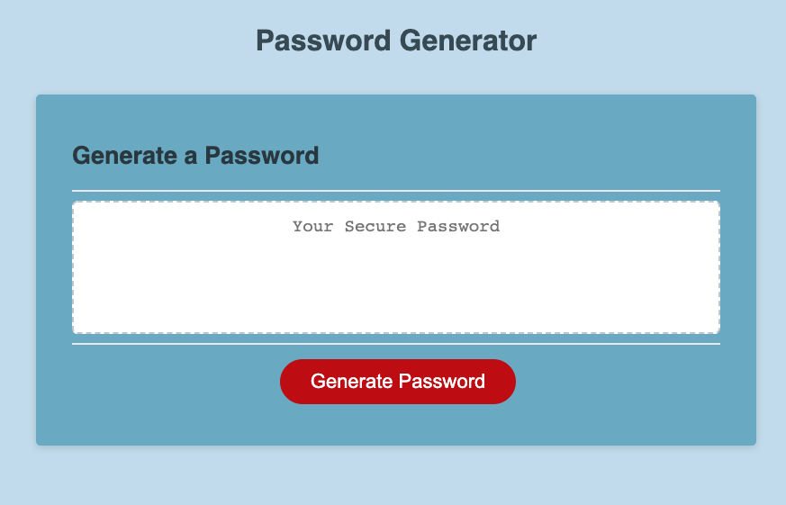

# Password_Generator

# Description

On this project, we need to create a secure password Generator for an employee to use. On this password Generator, we need to make sure that we used different unique characters such as upper and lower characters and numbers. 

# Pasword Generator

# Installation
The installation I used is:
* Terminal
* Visual Studio Code
* GitHub
* A list of Password Special Characters from the OWASP Foundation = https://owasp.org/www-community/password-special-characters

# License

2020 Alice Piar All rights Reserved.

